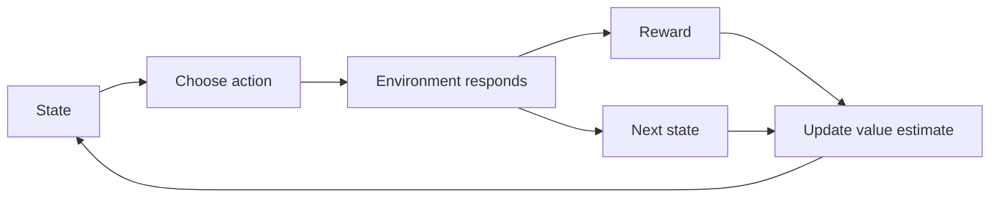
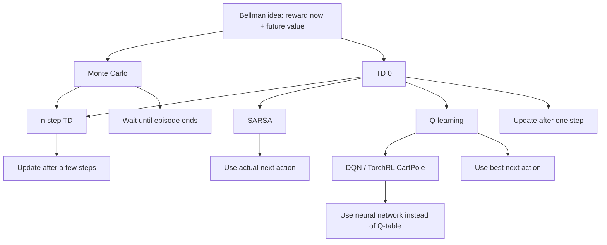
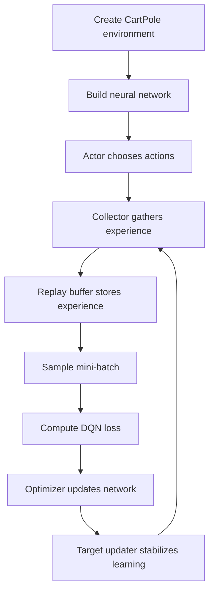

# Deep Reinforcement Learning Notes

Short study notes for the DRL course examples. The code files are examples; the main goal is to understand what each algorithm is trying to learn.

This README currently covers the foundations from modules 1 and 2. It is organized so later modules can be added as separate sections without rewriting the earlier notes.

## Table of Contents

- [How To Use This README](#how-to-use-this-readme)
- [Module 1: Reinforcement Learning Foundations](#module-1-reinforcement-learning-foundations)
- [Module 2: Prediction and Control Methods](#module-2-prediction-and-control-methods)
- [Notes About These Course Examples](#notes-about-these-course-examples)

## How To Use This README

Each module section should include:

- the main concepts introduced in that module
- the files or examples that belong to it
- a quick comparison table when there are several related algorithms
- notes about any simplifications or quirks in the course code

When adding a new module, create a new `## Module N: Title` section and add it to the table of contents.

## Module 1: Reinforcement Learning Foundations

Module 1 introduces the basic RL vocabulary and learning loop.

### Main RL Loop



The important idea: in a real RL environment, the action should affect what next state happens. Some course examples are simplified, so they show the formula even if the action does not really control the transition.

### Core Vocabulary

```text
Agent:       the learner or decision-maker
Environment: the system the agent interacts with
State:       what the agent observes about the situation
Action:      what the agent chooses to do
Reward:      feedback signal from the environment
Policy:      the rule the agent uses to choose actions
Value:       estimate of how good a state or action is
```

## Module 2: Prediction and Control Methods

Module 2 connects the Bellman idea to practical value-estimation and control methods.

### Run Commands

Use the local virtual environment:

```powershell
.\.venv\Scripts\python.exe .\module2\bellman_9489.py
.\.venv\Scripts\python.exe .\module2\montecarlo_4857.py
.\.venv\Scripts\python.exe .\module2\temporaldifference_7016.py
.\.venv\Scripts\python.exe .\module2\sarsa-qlearning_4747.py
.\.venv\Scripts\python.exe .\module2\samplecode_2934.py
```

If the environment is missing, create it and install the TorchRL dependencies:

```powershell
C:/Users/azadeh.ghaffari/AppData/Local/Programs/Python/Python313/python.exe -m venv .venv
.\.venv\Scripts\python.exe -m pip install --upgrade pip
.\.venv\Scripts\python.exe -m pip install torch torchrl 'gymnasium[classic-control]'
```

### Algorithm Map



### Quick Comparison

| File | Algorithm | Learns | When it updates | Key idea |
|---|---|---|---|---|
| `bellman_9489.py` | Bellman update | `V(state)` | one update pass | value = reward now + discounted next value |
| `montecarlo_4857.py` | Monte Carlo | `V(state)` | after full episode | average total returns from complete runs |
| `temporaldifference_7016.py` | TD(0) | `V(state)` | after one step | reward now + estimated next-state value |
| `n-step_9169.py` | n-step TD | `V(state)` | after `n` steps | middle between TD and Monte Carlo |
| `sarsa-qlearning_4747.py` | SARSA / Q-learning | `Q(state, action)` | after each step | actual next action vs best next action |
| `samplecode_2934.py` | DQN with TorchRL | neural-network Q-values | batches of experience | Q-learning with a neural network and replay buffer |

### How To Remember

```text
Bellman:      the core formula: reward now + future value
Monte Carlo:  wait for the full episode, then learn
TD(0):        learn after one step
n-step TD:    learn after a few steps
SARSA:        learn Q-values using the action actually taken next
Q-learning:   learn Q-values using the best possible next action
DQN:          Q-learning with a neural network instead of a table
```

### Common Confusions

#### State value vs action value

```text
V(state) = how good is this state?
Q(state, action) = how good is this action from this state?
```

State values help evaluate where the agent is. Action values help the agent choose what to do.

#### Monte Carlo vs TD

```text
Monte Carlo waits until the episode ends.
TD updates while the episode is still running.
n-step TD waits for a few rewards, then updates.
```

An episode is one full attempt from start to terminal state, such as CartPole starting upright and ending when the pole falls.

#### SARSA vs Q-learning

```text
SARSA target:      reward + gamma * Q(next_state, actual_next_action)
Q-learning target: reward + gamma * max Q(next_state, all_actions)
```

SARSA learns from what the current policy really does, including exploration. Q-learning learns as if the agent will choose the best action next.

## Notes About These Course Examples

- `montecarlo_4857.py`: the policy returns an action, but the original code passes that action into `env.step(action)` even though `step` treats the input like a state. Conceptually, this should usually be `env.step(state, action)`.
- `sarsa-qlearning_4747.py`: the toy environment cycles `0 -> 1 -> 2 -> 0`; `action` is chosen but does not affect the next state. It is useful for formulas, not as a realistic environment.
- `n-step_9169.py`: the function is defined but not called. It also uses `s_t = states`, but the intended starting state is probably `states[0]`.
- `samplecode_2934.py`: updated for the installed TorchRL API: `Collector`, `spec=env.action_spec`, and `HardUpdate`.

### DQN / TorchRL Flow



The big idea: DQN still uses the Bellman/Q-learning idea, but it stores Q-values inside a neural network instead of a small table.
