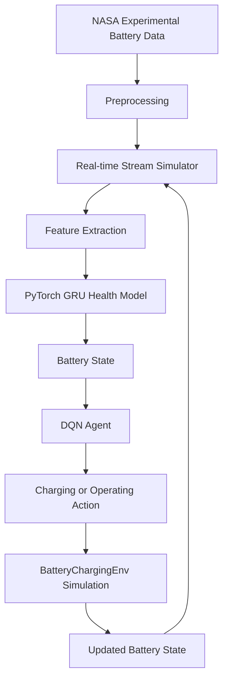

# Real-Time EV Battery Health & Charging Optimization Agent

This project is an academic simulation that combines a PyTorch battery-health model with a Deep Q-Network (DQN) agent to demonstrate a closed-loop battery-management workflow on public NASA lithium-ion aging data.

It is not a real battery-management system and must not be presented as safe for use on a physical EV battery.

## Business Problem

EV batteries face a trade-off between fast charging, thermal stress, and long-term degradation. The project goal is to simulate a controller that does more than predict battery health: it should estimate battery condition from historical experimental measurements, choose a charging or operating action, simulate the effect of that action, and repeat that loop in near real time.

## Approach

The project uses two connected learning components:

- A PyTorch GRU model estimates state of health (SOH) and degradation risk from time-series battery measurements.
- A PyTorch DQN agent observes the current battery state and chooses one of five discrete actions.

Recommended background reading for the report and presentation:

- NASA DASHLINK Li-ion Battery Aging Dataset: https://c3.ndc.nasa.gov/dashlink/resources/133/
- Mnih et al., Human-level control through deep reinforcement learning
- Battery prognostics / SOH papers that use the NASA PCoE cells
- Safe or constrained RL papers for energy systems, charging, or control under operating limits

## Methodology

1. Place NASA `.mat` battery files in `data/raw/`.
2. Parse charge and discharge cycles into tabular time-series records.
3. Engineer SOC, trend features, SOH proxy values, and degradation-risk targets.
4. Train a PyTorch GRU battery-health model.
5. Build a custom Gymnasium-compatible environment around replayed historical measurements.
6. Train a DQN agent with replay buffer, target network, and epsilon-greedy exploration.
7. Compare the DQN against fixed and rule-based policies.
8. Visualize the closed loop in a Streamlit dashboard.

## Pipeline


```mermaid
flowchart TD
    A[NASA Experimental Battery Data] --> B[Preprocessing]
    B --> C[Real-time Stream Simulator]
    C --> D[Feature Extraction]
    D --> E[PyTorch GRU Health Model]
    E --> F[Battery State]
    F --> G[DQN Agent]
    G --> H[Charging or Operating Action]
    H --> I[BatteryChargingEnv Simulation]
    I --> J[Updated Battery State]
    J --> C
```

## Repository Layout

```text
battery-drl-agent/
├── artifacts/
├── config/
├── dashboard/
├── data/
├── data_pipeline/
├── environment/
├── evaluation/
├── models/
├── rl/
├── tests/
├── training/
├── main.py
└── requirements.txt
```

## NASA Data

Public source:

- NASA Open Data catalog: https://data.nasa.gov/dataset/li-ion-battery-aging-datasets
- NASA DASHLINK landing page: https://c3.ndc.nasa.gov/dashlink/resources/133/
- DASHLINK source files page referenced by NASA: http://ti.arc.nasa.gov/c/5/

Expected raw files:

- `B0005.mat`
- `B0006.mat`
- `B0007.mat`
- `B0018.mat`

Put the raw `.mat` files under `data/raw/`. These four files are already downloaded and present in this repo (~15-16 MB each), extracted from the official archive at `https://phm-datasets.s3.amazonaws.com/NASA/5.+Battery+Data+Set.zip` (linked from the NASA PCoE data repository page).

## Install

This project shares the root-level `.venv` used by the rest of the repo.

```powershell
cd .\battery-drl-agent
..\.venv\Scripts\python.exe -m pip install --upgrade pip
..\.venv\Scripts\python.exe -m pip install -r requirements.txt
```

If `.venv` is newly created and `pip` is missing, bootstrap it first:

```powershell
..\.venv\Scripts\python.exe -m ensurepip --upgrade
```

## Tests

```powershell
cd .\battery-drl-agent
..\.venv\Scripts\python.exe -m pytest .\tests -q
```

Both `test_battery_env.py` (reset/step behavior, reward sign on unsafe actions) and `test_replay_buffer.py` (sampling shapes) pass against the installed dependencies.

## Run Order

Run `loader.py` and `preprocessing.py` as modules from the `battery-drl-agent` folder so the `data_pipeline` package import resolves.

### 1. Inspect the raw dataset

```powershell
..\.venv\Scripts\python.exe .\data_pipeline\loader.py
```

### 2. Preprocess the NASA data

```powershell
..\.venv\Scripts\python.exe -m data_pipeline.preprocessing
```

### 3. Train the battery-health model

```powershell
..\.venv\Scripts\python.exe -m training.train_health_model
```

### 4. Train the DQN agent

```powershell
..\.venv\Scripts\python.exe -m rl.train_dqn
```

### 5. Evaluate policies

```powershell
..\.venv\Scripts\python.exe -m evaluation.evaluate_agent
```

### 6. Launch the dashboard

```powershell
..\.venv\Scripts\python.exe -m streamlit run .\dashboard\app.py
```

## Runtime Expectations

Measured on the actual NASA data in this repo (4 batteries, ~2.1M raw rows, CPU-only):

| Step | Measured / estimated time |
|---|---|
| `loader.py` (parse `.mat` files) | ~12 s |
| `preprocessing.py` (features + split) | ~38 s |
| `training.train_health_model` (15 epochs) | ~10-12 min |
| `rl.train_dqn` (120 episodes) | ~1-2 min |
| `evaluation.evaluate_agent` | under 1 min |

Total end-to-end run: roughly **15-20 minutes** on CPU. The health-model step dominates.

Two tuning choices keep this practical:

- `health_model.sequence_stride` in `config/config.yaml` (default `5`) samples training windows every 5 timesteps instead of every timestep, cutting ~1.17M overlapping sequences down to ~235K without losing much signal (adjacent windows are nearly identical). Lower it toward `1` for a slower, denser fit; raise it for faster iteration.
- The `STOP` action (4) no longer ends an episode by itself. Only the environment's own safety condition (temperature at or above `critical_temp_c`) terminates an episode early; otherwise episodes run for the full `episode_horizon` (or until the replayed data runs out). This was changed because epsilon-greedy exploration was picking `STOP` roughly 1 in 5 steps early in training, which previously ended episodes after ~3 steps on average and left the agent almost no learning signal.

## Model Estimation And Metrics

Battery-health model metrics:

- MAE for SOH
- RMSE for SOH
- Validation loss

RL evaluation metrics:

- Total reward
- Charging or operating progress toward target SOC
- Temperature exposure above threshold
- Unsafe event count
- Mean degradation risk
- Action distribution

## Interpretation Of Results

The core project claim should be modest and testable:

- The GRU can estimate battery condition from historical measurements.
- The DQN can learn a policy that reduces charging stress when temperature and degradation risk rise.
- The learned policy should be compared against simpler baselines, not judged only by reward.

## Decision Support

The dashboard is intended to support human interpretation. It shows:

- measured battery state
- predicted SOH and degradation risk
- chosen RL action
- DQN Q-values
- time-series charts for voltage, current, temperature, SOC, SOH, risk, and actions

## Why This Matters

The relevance of the project is that EV energy-management systems must balance performance and asset health. Even a simplified academic simulation is useful because it shows how supervised sequence modeling and sequential decision-making can be combined in one closed loop.

## Assumptions And Limits

- The environment is data-driven and simplified, not electrochemical.
- Historical NASA measurements are replayed sequentially to avoid future leakage.
- The reward values are configurable in `config/config.yaml` and should be discussed explicitly in the report.
- The DQN operates on a discrete action space only because this is a first prototype.

## Suggested Presentation Structure

If you need to align the code with the course deliverables, a compact presentation can use:

1. Problem and motivation
2. Data and preprocessing
3. Health model and RL environment design
4. DQN training and evaluation results
5. Demo, limitations, and future work

The course text you shared mentions both a short five-slide presentation and a longer written report. Confirm slide-count expectations with the instructor, because the written requirements appear inconsistent.